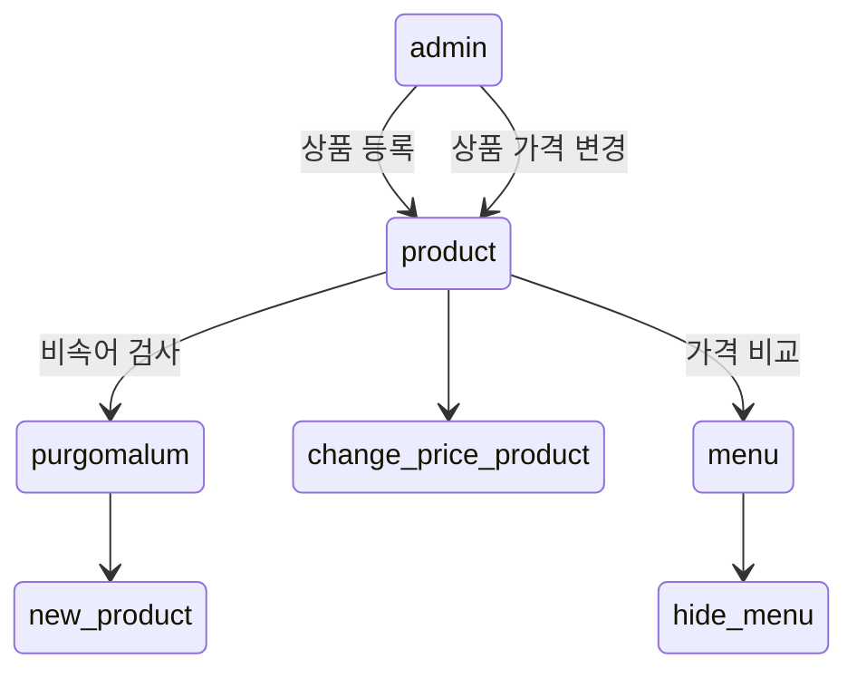
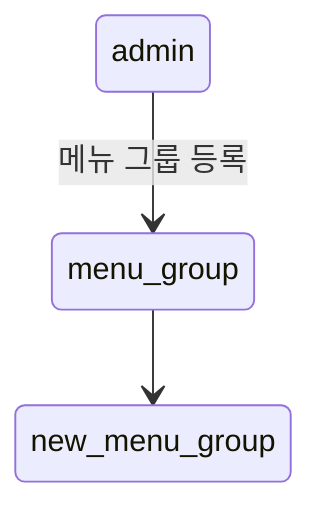
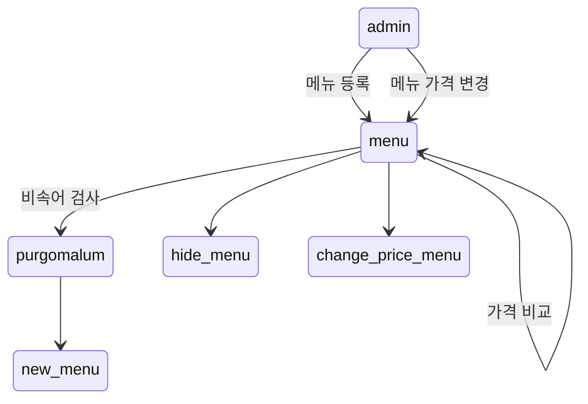
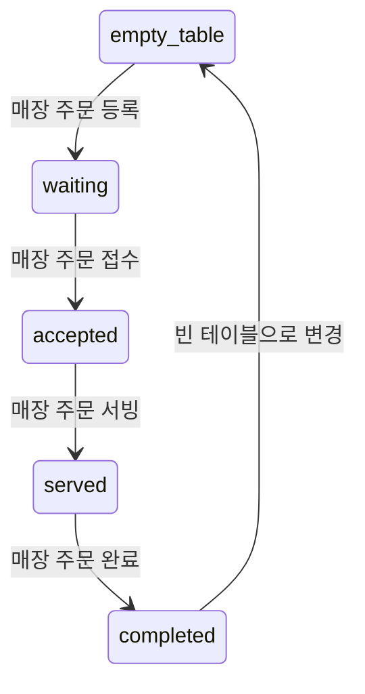
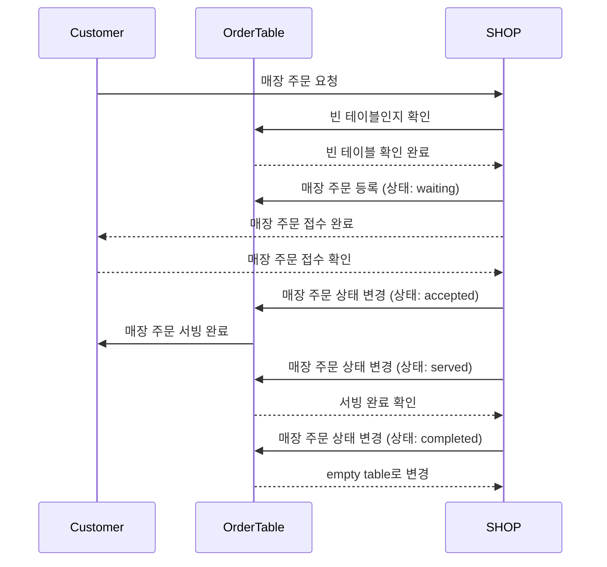
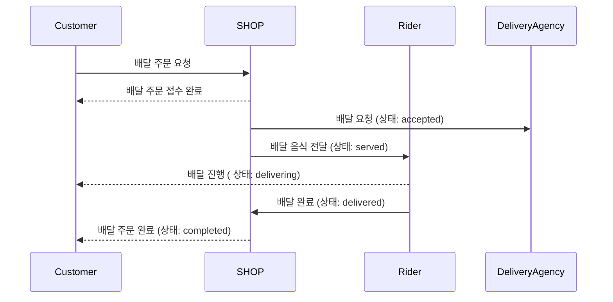
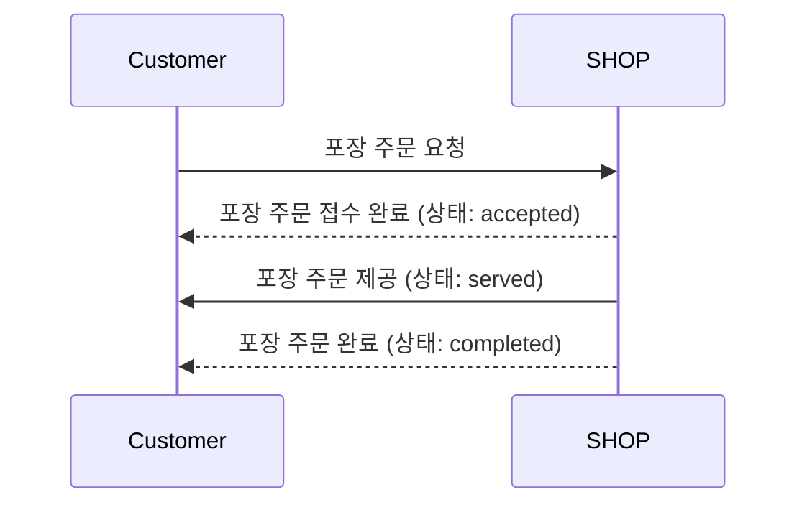

## 모델링

### 상품

- `product`은 식별자와 이름, 가격을 가진다.
- `name`은 외부솔루션 `PurgomalumClient`을 통해 비속어 검사를 통과한 이름만 가질 수 있다.
- `price`은 0원 이상만 등록 가능하다.
- `product`은 `price` 0원 이상인 가격으로 변경한다.
- `price`을 변경할 때 해당 상품이 속한 메뉴들의 가격 비교 후 메뉴 가격보다 단일 상품들의 총금액이 더 비쌀 경우 해당 메뉴은 자동으로 숨김 상태로 변경된다.

### 메뉴그룹

- `menu_group`은 식별자와 이름을 가진다.
- `name`은 빈값이 아닌 이름만 가질 수 있다.

### 메뉴

- `menu`은 식별자와 이름, 가격, `menu_group`, 상태(노출/숨김), 메뉴상품들을 가진다.
- `name`은 외부솔루션 `PurgomalumClient`을 통해 비속어 검사를 통과한 이름만 가질 수 있다.
- `price`은 0원 이상만 등록 가능하다.
- `menu`은 `price` 0원 이상인 가격으로 변경한다.
- `menu`는 1개 이상의 `product`로 구성된다.
- `price`을 변경할 때 변경할 가격으로 메뉴 가격비교 후 더 비쌀 경우 자동으로 메뉴를 숨김 상태로 변경한다.

### 주문테이블

- `order_table` 는 식별자와 이름, 손님 수, 빈 테이블 여부를 가진다.
- 빈 테이블 `empty table`은 주문을 받을 수 있는 상태를 의미한다. 이 상태의 `NumberOfGuests`는 0이다.
- 방문 손님 수 `number of guests`는 주문 테이블에 앉아있는 고객 수를 의미한다.
- `eat in order` -> `waiting` -> `accepted` -> `served` -> `completed` 순으로 주문이 진행된다.
    - `completed` 이후 해당 `order_table` 은 다시 `empty table` 상태로 변경된다.

### 주문

- `order`는 주문을 의미한다. 식별자 ,`order type`,`order status`,`order line item`를 가진다
- `order`의 `order type`에 따라 추가적인 값을 가질 수 있다.
- `order status`는 주문의 진행 상태를 의미한다. `order type` 에 따라 다른 상태를 가진다.
- `order line item`은 주문된 `menu`와 수량을 의미한다.
- `order_line_item`을 가질 수 있으며 수량이 0 미만일 수 있다.
- `order_line_item`의 주문 가능한 `menu`는 `display` 상태인 메뉴이다.

### 매장 주문

- `order`의 `order type`이 `eat in order`이 매장에서 주문한 주문을 의미한다.
- `empty table` 이 있어야 주문을 등록할 수 있다.
- 주문 요청 시 `waiting` -> `accepted` -> `served` -> `completed` 순으로 주문이 진행된다.
    - `completed` 이후 사용 된 `order_table` 은 다시 `empty table` 상태로 변경된다.

### 배달 주문

- `order`의 `order type`이 `delivery order`이 배달 주문을 의미한다.
- `delivery order`는 `delivery address`를 가진다.
- 주문 요청 시 `waiting` -> `accepted` -> `served` -> `delivering` -> `delivered` -> `completed` 순으로 주문이 진행된다.
- 배달 주문이 `accepted`  시 `delivery agency`를 호출한다.

### 포장 주문

- `order`의 `order type`이 `takeout order`이 포장 주문을 의미한다.
- 주문 요청 시 `waiting` -> `accepted` -> `served` -> `completed` 순으로 주문이 진행된다.

